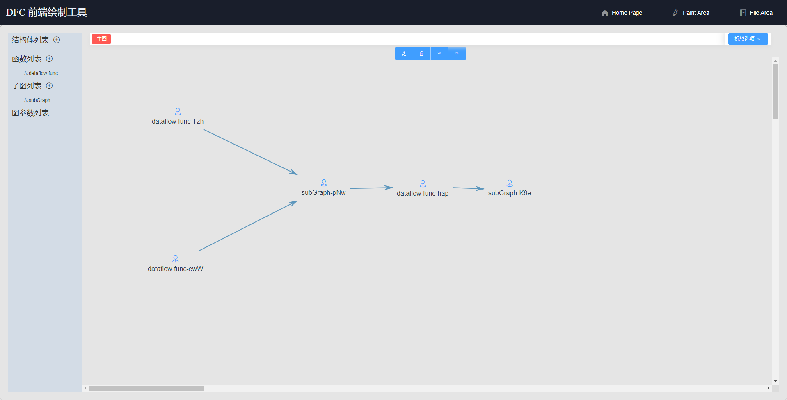

# dfc_front

* dfc_front is a web-front for [dfc](https://github.com/luoszu/DFC) paint,dfc is a dataflow language disigned by SZU NHPCC SKT.
* in this platform,we can design our dataflow graph and translate it to dfc code.
* mainly use jsplumb and vue.js

 
 
## Project setup
```
npm install
```

### Compiles and hot-reloads for development
```
npm run serve
```

### Compiles and minifies for production
```
npm run build
place the dist to nginx html dir.eg:in centos,is /usr/share/nginx/html/
then in nginx redir the api req to backend 
```

### Lints and fixes files
```
npm run lint
```

### Customize configuration
See [Configuration Reference](https://cli.vuejs.org/config/).

